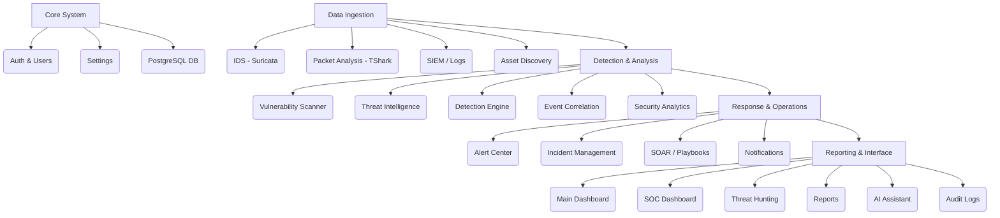
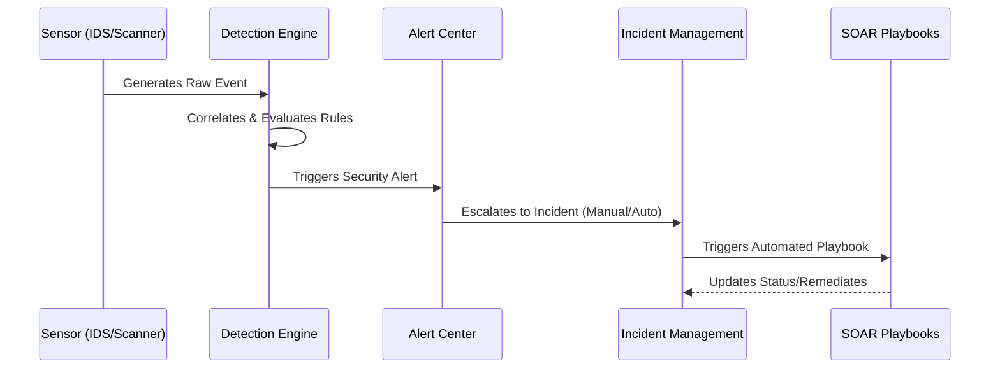

# Architecture Overview

## Introduction
CyberDefense XDR is a comprehensive Extended Detection and Response (XDR) platform developed as a B.Tech cybersecurity final-year project. It aggregates data across multiple security domains (network, endpoints, cloud, threat intel) to provide real-time detection, automated response, and advanced threat hunting powered by AI.

## Technology Stack
- **Framework**: Flask 3.1.3
- **Language**: Python 3.13
- **Database**: PostgreSQL 15+
- **ORM**: SQLAlchemy 2.0
- **Migrations**: Alembic (Flask-Migrate)
- **Application Server**: Gunicorn

## Module Organization

The application is structured into 23 functional modules, managed via Flask blueprints.

### Blueprints & URL Prefixes
| Module | Blueprint Name | Role |
|--------|----------------|------|
| Main | `main` | Core routing and root views |
| Authentication | `auth` (`/auth`) | Login, registration, password management |
| Dashboard | `dashboard` | User landing dashboard |
| Settings | `settings` | System and user preferences |
| Detection | `detection` | Rule-based threat detection |
| Incidents | `incidents` | Case management for security incidents |
| Alerts | `alerts` | Consolidated alert queue |
| Threat Intel | `threatintel` | IOCs, Campaigns, Threat Actors |
| SIEM | `siem` | Log ingestion and query |
| Scanner | `scanner` | Active vulnerability scanning |
| IDS | `ids` | Network intrusion detection |
| Packet Analysis | `packet_analysis` | PCAP processing & inspection |
| Assets | `assets` | Asset inventory and tracking |
| SOC Dashboard | `soc_dashboard` | High-level SOC metric views |
| Reports | `reports` | Automated reporting generation |
| Analytics | `analytics` | Threat statistics and metric trends |
| Threat Hunting | `threat_hunting` | Proactive threat hunting queries |
| Correlation | `correlation` | Cross-module event correlation |
| AI Assistant | `ai_assistant` | Generative AI investigations |
| SOAR | `soar` | Automated response playbooks |
| User Management| `user_management`| RBAC and user administration |
| Audit Logs | `audit_logs` | System audit trail |
| Notifications | `notifications` | In-app user notifications |

## Extension Architecture
Extensions are initialized centrally in `app/extensions.py` to prevent circular dependencies:
- **`db` (SQLAlchemy)**: Database connection and ORM.
- **`migrate` (Flask-Migrate)**: Database schema migration wrapper around Alembic.
- **`login_manager` (Flask-Login)**: Session management.
- **`csrf` (Flask-WTF)**: Cross-Site Request Forgery protection.

## Security Layers
1. **OWASP Headers**: Applied globally via an `@app.after_request` handler (CSP, X-Content-Type-Options, etc.).
2. **CSRF Protection**: Enforced on all state-changing endpoints via Flask-WTF.
3. **Role-Based Access Control (RBAC)**: Centralized permission checks and decorators for restricted endpoints.
4. **Input Sanitization**: Extensive validation to prevent shell injection, prompt injection, and CSV injection.

## Data Flow: Detection to SOAR

## External Integrations
*Note: Some integrations require environmental dependencies.*
- **Suricata**: Log ingestion for the IDS module.
- **TShark**: PCAP processing for the Packet Analysis module.
- **Nmap, Nikto, Nuclei, WhatWeb, testssl.sh**: Active security scanners leveraged by the Scanner module.
- **Gemini AI**: Powers the AI Assistant module (requires API key).
