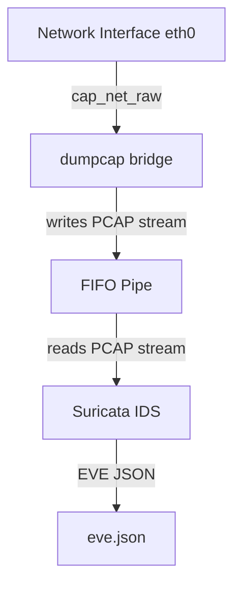

# Network Intrusion Detection System (NIDS)

## Overview
CyberDefense XDR integrates Suricata as its core Network Intrusion Detection System (NIDS) to monitor network traffic in real-time, generate alerts for suspicious activity, and provide telemetry for analysis. The architecture employs a privilege-safe capture design using a FIFO pipe bridge.

## Architecture and Components

### Privilege-Safe Capture Design
The system utilizes a dual-process architecture to capture network traffic securely without running the entire Suricata engine as root:
- **dumpcap**: Acts as a lightweight bridge. It possesses `cap_net_raw` and `cap_net_admin` capabilities, allowing it to perform unprivileged live packet capture on interfaces (e.g., `eth0`). It writes the captured packets directly to a named FIFO pipe.
- **Suricata**: Reads the packet stream from the FIFO pipe (`/var/lib/suricata/suricata_pipe` or equivalent log directory pipe). It runs with standard privileges, reducing the attack surface.

### EVE JSON Ingestion
Suricata outputs events to `eve.json`. A background worker thread asynchronously tails this file and ingests lines into the PostgreSQL database. 
- **Deduplication**: To ensure idempotency and prevent duplicate records on service restarts, a deterministic 64-character SHA-256 hash (`event_uuid`) is computed for each event based on its timestamp, event type, flow ID, source IP/port, destination IP/port, and signature ID.

### Diagnostic vs. Security Alert Classification
The ingestion pipeline automatically classifies events to prevent alert fatigue:
- **Diagnostic Events**: Known NIC offload and packet decode/checksum errors are suppressed from the Alert Center. These are identified by SID `2200074` or signatures containing "invalid checksum" (e.g., "SURICATA TCPv4 invalid checksum").
- **Security Alerts**: Genuine intrusion or exploit detections (where `event_type == "alert"` and not diagnostic) are forwarded to the Alert Center and SIEM.
- **Telemetry**: Normal network flows, DNS queries, TLS handshakes, and HTTP metadata.

### Safe Log Rotation
A background daemon (`log_rotator.py`) continuously manages log file sizes (`eve.json`, `fast.log`, `stats.log`, `suricata.log`). 
- Uses Suricata-native `SIGHUP` signaling to coordinate log reopening.
- Implements safe shifting of archives and streaming gzip compression.
- Bounded retention limits the number of kept archives.
- Strict path validations prevent arbitrary file rotation or path traversal attacks.

## Usage and Configuration

### External Binaries and System Paths
The module interacts with the following system binaries and paths:
- **Binaries**: `/usr/bin/suricata`, `/usr/bin/suricata-update`, `/usr/bin/dumpcap`
- **Config**: `/etc/suricata/suricata.yaml`
- **Rules**: `/var/lib/suricata/rules/suricata.rules` (Updated via `suricata-update`)

### Docker Considerations
**Limitation**: The Network IDS module CANNOT run in standard Docker containers because direct packet capture requires the `AF_PACKET` socket family and `cap_net_raw` capabilities on the host network interfaces, which are typically isolated or restricted in containerized environments.

## API Endpoints
- `GET /network-ids/api/dashboard` - IDS KPIs and statistics.
- `GET /network-ids/api/events` - Paginated event explorer.
- `POST /network-ids/api/sensor/start` - Starts the sensor using the dumpcap bridge.
- `POST /network-ids/api/sensor/stop` - Gracefully stops the sensor.
- `POST /network-ids/api/rules/update` - Triggers `suricata-update`.
- `POST /network-ids/api/logs/rotate` - Manually triggers log rotation.
